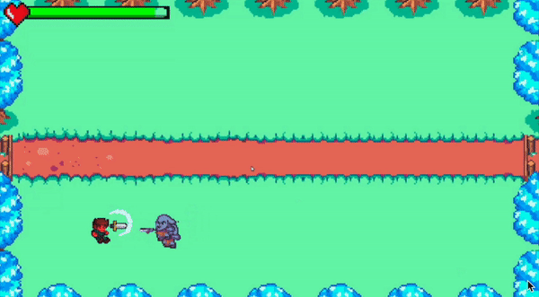
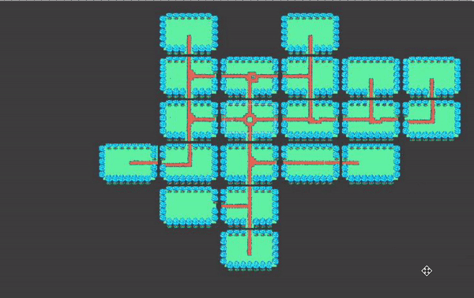

# Bachelor's degree 3rd year game project 

During my 3rd year of a bachelor's degree in Computer Science, I spent 1 month developing a game in Unity. 
It's a 2D action game inspired by The Binding Of Isaac and Slormancer. 
The levels are randomly generated, and there are currently 2 types of enemy with simple attack paths and a boss with u more complex attack paths. 
I used the assets provided by Kenney on his website. 

